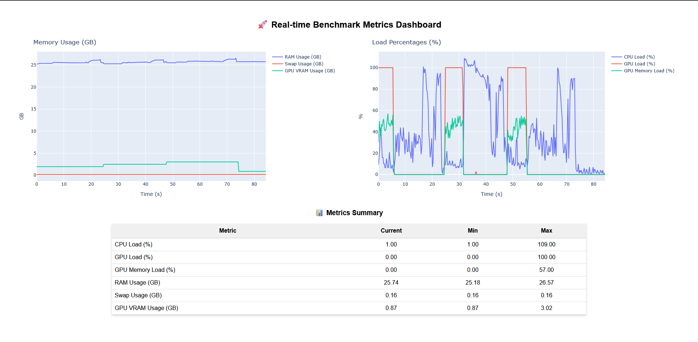

# 🚀 Benchmetrics: Real-Time System Benchmarking and Dashboard

**Benchmetrics** is a Python library designed to seamlessly measure and visualize system performance metrics (**CPU, GPU, RAM, Swap, and GPU memory usage**) during heavy computations.

## 📌 Features

- ⚡ **Non-blocking metric collection** in a separate process.
- 🎨 **Real-time interactive dashboard** powered by Dash and Plotly.
- 🖥️ **Easy integration** into PyQt6 or any Python project.
- 🏃 **Minimal Overhead**: Lightweight processes ensure your main application is unaffected.
- 🚀 **Automatic Dashboard Launch**: Opens in the default browser automatically.
- 🔄 **Dynamic Port Selection**: Picks an available port to avoid conflicts.

---

## 🦺 Screenshot



---

## 🚀 Installation

Install directly from source (assuming you have `uv` installed):

```sh
uv pip install -e .
```

To install additional dependencies for running the **example**, use:

```sh
uv pip install -e . --extra example
```

### 📞 Dependencies

All necessary dependencies are automatically installed:

- `numpy` (numerical operations)
- `psutil` (system metrics)
- `pynvml` (GPU metrics for NVIDIA GPUs)

For running the **example**, these additional dependencies are needed:

- `dash` (real-time visualization)
- `plotly` (graphing)
- `pyqt6` (GUI embedding)
- `pywin32` (Windows support)
- `torch` (for heavy computation testing)

---

## 🎯 Quick Start

Here's how you can quickly integrate **Benchmetrics** in your project:

### **Basic Usage**

```python
from benchmetrics import Benchmark
import time

benchmark = Benchmark(interval=0.5, dashboard=True, auto_open=True)
benchmark.start()

# Your heavy computation here
for i in range(10):
    print(f"Computing iteration {i+1}")
    time.sleep(1)  # Replace with your actual computation

benchmark.stop()
```

Upon running, Benchmetrics automatically opens an interactive dashboard in your default web browser:

```sh
🔗 Dashboard running at: http://127.0.0.1:56789
💪 Dashboard is ready at: http://127.0.0.1:56789
```

---

## 💡 Running the Example

To test Benchmetrics with a **real example**, run:

```sh
uv run examples/example.py
```

This will start a PyQt6 application that simulates heavy CPU and GPU computation while monitoring system performance in real time.

---

## 💡 Advanced Integration (PyQt6 Example)

If your project uses **PyQt6**, Benchmetrics integrates seamlessly:

```python
from PyQt6.QtWidgets import QApplication, QWidget, QPushButton, QVBoxLayout
from benchmetrics import Benchmark
import sys

class AppDemo(QWidget):
    def __init__(self):
        super().__init__()
        self.benchmark = Benchmark(dashboard=True, auto_open=True)
        btn_start = QPushButton('Start Benchmark')
        btn_start.clicked.connect(self.start_benchmark)
        
        layout = QVBoxLayout()
        layout.addWidget(btn_start)
        self.setLayout(layout)

    def start_benchmark(self):
        self.benchmark.start()

app = QApplication(sys.argv)
demo = AppDemo()
demo.show()
sys.exit(app.exec())
```

---

## 🐍 Compatibility

- ✅ **Operating Systems**: Windows, Linux, macOS
- ✅ **Python versions**: Python 3.9+

---

## 📌 Notes on GPU Monitoring

- **GPU metrics rely on NVIDIA GPUs** with the `pynvml` package.
- Ensure your system has **NVIDIA drivers installed**.

---

## 🔧 Development

To contribute or modify:

```sh
uv pip install -e ".[dev]"
```

Run examples to validate changes:

```sh
uv run examples/example.py
```

---

## 📝 License

This project is licensed under the **MIT License** – see the [LICENSE](LICENSE) file for details.

---

## 🙌 Contributing

Pull requests and feedback are always welcome!

